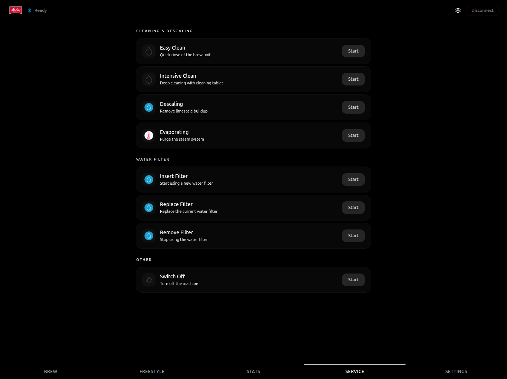

# Melitta Barista App

[](https://github.com/dzerik/melitta-barista-app/actions/workflows/ci.yml)
[](https://dzerik.github.io/melitta-barista-app/)
[](https://github.com/dzerik/melitta-barista-app/releases)
[](LICENSE)

Standalone PWA for controlling Melitta Barista Smart coffee machines via Home Assistant WebSocket API.

**[Live Demo](https://dzerik.github.io/melitta-barista-app/)** (requires your own Home Assistant instance with the [Melitta integration](https://github.com/dzerik/melitta-barista-ha))

## Screenshots

### Brew

Browse all available recipes in a grid, list, or carousel view. Quick-access buttons for favorite recipes and user profiles at the top. Select a recipe and tap **Brew** to start.


### Freestyle

Build a custom drink from scratch with two configurable components. Adjust process type, portion size, intensity, aroma, temperature, and shots for each component. A live glass preview updates as you tweak the parameters.


### Stats

Cup counter dashboard showing total brewed cups and per-recipe statistics with progress bars.


### Service

Maintenance operations: easy clean, intensive clean, descaling, evaporating, water filter management, and power off.



### Settings

Machine configuration: energy saving, auto bean select, rinsing toggle, water hardness, auto-off timer, and brew temperature.


## Features

- **Recipe Grid** — 24 drink profiles with schematic glass cup icons showing drink layers
- **Freestyle Builder** — create custom drinks with a dynamic glass visualization that fills with ingredients in real-time
- **Stats Dashboard** — total cup counter and per-recipe statistics
- **Profile Support** — switch between user profiles with customized recipe parameters
- **Machine States** — fullscreen displays for offline, cleaning, descaling, and action-required states
- **Service** — maintenance operations: cleaning, descaling, water filter management
- **Settings** — machine configuration: water hardness, energy saving, auto-off, brew temperature
- **PWA** — installable as a standalone app on any device

## Requirements

- [Melitta Barista Smart HA Integration](https://github.com/dzerik/melitta-barista-ha) v0.8.0+
- Home Assistant with a long-lived access token
- Melitta Barista T Smart or Barista TS Smart

## Getting Started

```bash
npm install
npm run dev
```

Open the app, enter your Home Assistant URL and long-lived access token. The app will auto-discover the Melitta machine from HA entities.

### Build for production

```bash
npm run build
```

The `dist/` folder can be served as a static site or installed as a PWA.

## Deploy

The app is automatically deployed to **GitHub Pages** on every push to `main`. It's also available as a PWA you can install on any device.

The hosted version at `https://dzerik.github.io/melitta-barista-app/` is a static SPA -- all communication happens directly between the user's browser and their own Home Assistant instance via WebSocket. No data passes through any third-party server.

### Self-host

```bash
npm run build
# serve the dist/ folder with any static file server (nginx, caddy, etc.)
```

Set `VITE_BASE` to your desired base path during build:

```bash
VITE_BASE=/my-path/ npm run build
```

## Security

The app stores the HA URL and long-lived access token **only in the browser's localStorage**. No credentials are sent to any external server -- the WebSocket connection goes directly from the browser to your Home Assistant instance. The deployed static files contain no secrets.

## Tech Stack

- React 19 + TypeScript 5.9
- Vite 7 + Tailwind CSS 4
- home-assistant-js-websocket
- vite-plugin-pwa

## Disclaimer

This project is an independent, open-source, non-commercial application created for personal and home automation purposes. It is **not affiliated with, endorsed by, or connected to Melitta Group Management GmbH & Co. KG** or any of its subsidiaries.

"Melitta", "Barista T Smart", "Barista TS Smart", and the Melitta logo are registered trademarks of Melitta Group Management GmbH & Co. KG. All product names, logos, brands, and graphical assets are the property of their respective owners and are used here solely for identification and interoperability purposes.

This software is not intended for commercial use or the generation of revenue. See [NOTICE](NOTICE) for full legal details.

## Contributing

See [CONTRIBUTING.md](CONTRIBUTING.md).

## License

[MIT](LICENSE)
